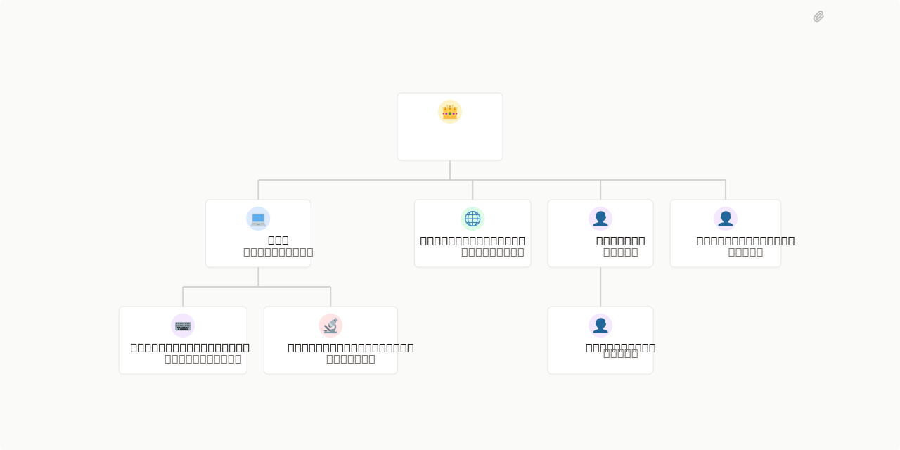

# FBC produções



## What's Inside

> This is an [Agent Company](https://agentcompanies.io) package from [Paperclip](https://paperclip.ing)

| Content | Count |
|---------|-------|
| Agents | 8 |
| Projects | 2 |
| Skills | 5 |
| Tasks | 51 |

### Agents

| Agent | Role | Reports To |
|-------|------|------------|
| CEO | CEO | — |
| CTO | CTO | ceo |
| FullStackEngineer | Engineer | cto |
| GrowthMarketing | CMO | ceo |
| OpsLead | general | ceo |
| ProductManager | pm | ceo |
| QASecurityReviewer | qa | cto |
| RevenueOps | general | opslead |

### Projects

- **Onboarding**
- **Select + Ops Diagnostico** — Antes de construir uma máquina de aquisição, o projeto precisa validar uma dor real, uma oferta inicial e um modelo de entrega mínimo.

A nova frente paralela parte de uma premissa estratégica: já existe acesso a ferramentas de automação e agentes de IA. Portanto, o primeiro produto validável pode ser um serviço/agente de diagnóstico operacional para empresas, com foco em identificar gargalos internos, perdas comerciais, tarefas repetitivas e oportunidades de automação.

### Skills

| Skill | Description | Source |
|-------|-------------|--------|
| paperclip-converting-plans-to-tasks | > | [github](https://github.com/paperclipai/paperclip/tree/e6407b322552b5c0aef3dd19835bb00627570b7d/skills/paperclip-converting-plans-to-tasks) |
| paperclip-create-agent | > | [github](https://github.com/paperclipai/paperclip/tree/e6407b322552b5c0aef3dd19835bb00627570b7d/skills/paperclip-create-agent) |
| paperclip-dev | > | [github](https://github.com/paperclipai/paperclip/tree/e6407b322552b5c0aef3dd19835bb00627570b7d/skills/paperclip-dev) |
| paperclip | > | [github](https://github.com/paperclipai/paperclip/tree/e6407b322552b5c0aef3dd19835bb00627570b7d/skills/paperclip) |
| para-memory-files | > | [github](https://github.com/paperclipai/paperclip/tree/e6407b322552b5c0aef3dd19835bb00627570b7d/skills/para-memory-files) |

## Getting Started

```bash
pnpm paperclipai company import this-github-url-or-folder
```

See [Paperclip](https://paperclip.ing) for more information.

---
Exported from [Paperclip](https://paperclip.ing) on 2026-06-26
